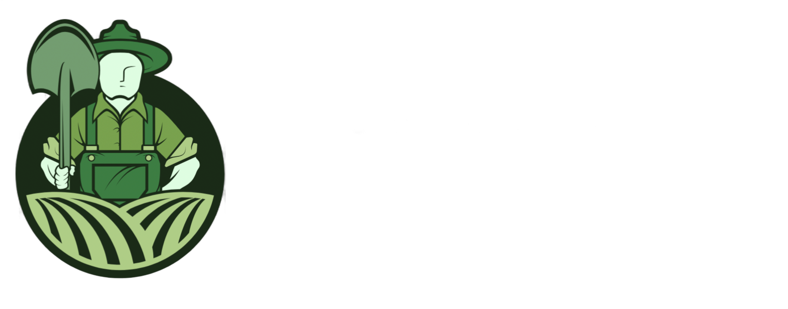
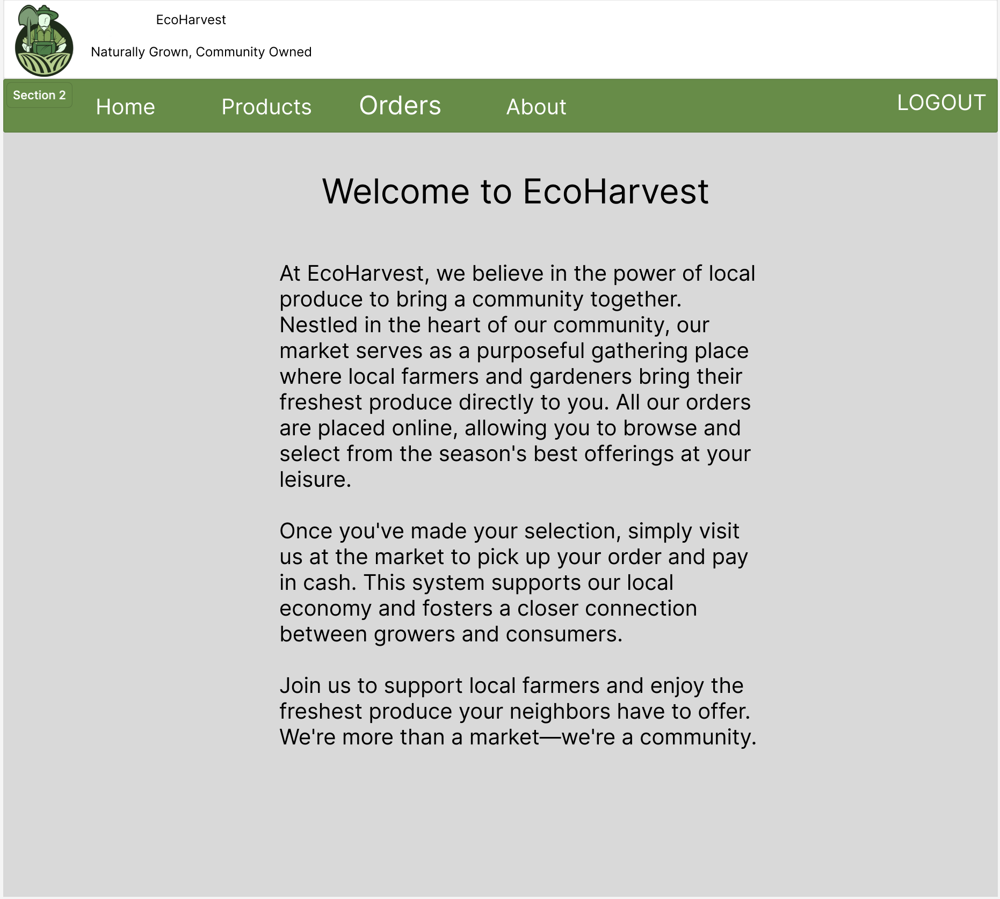
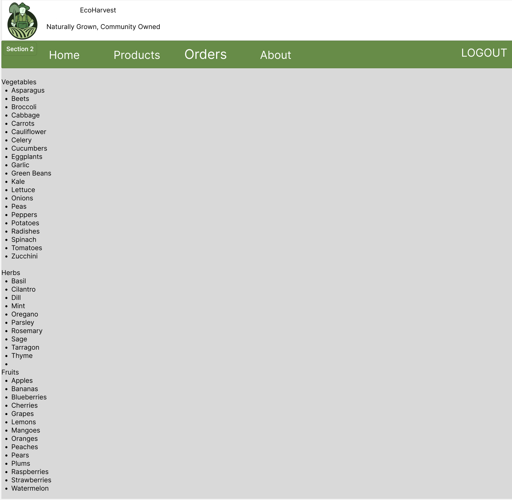
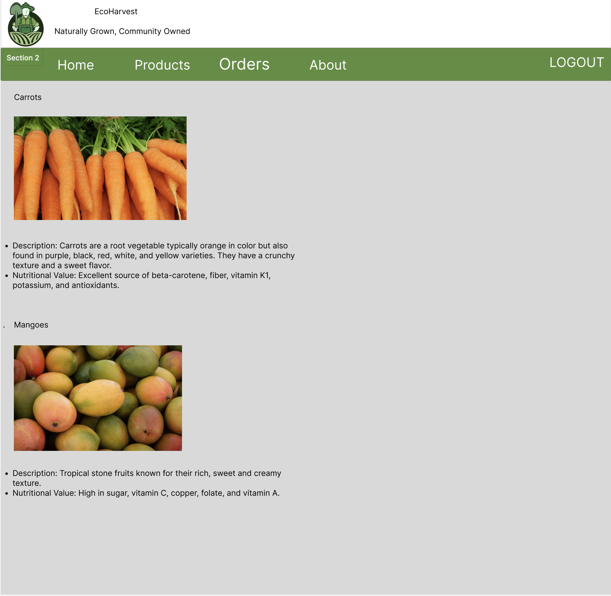
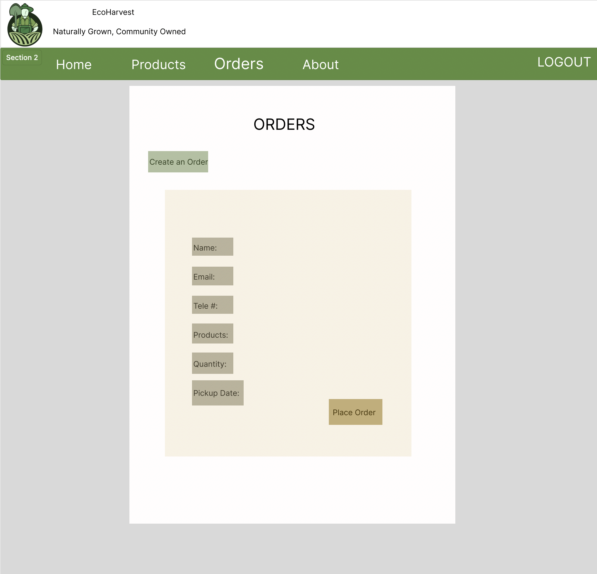
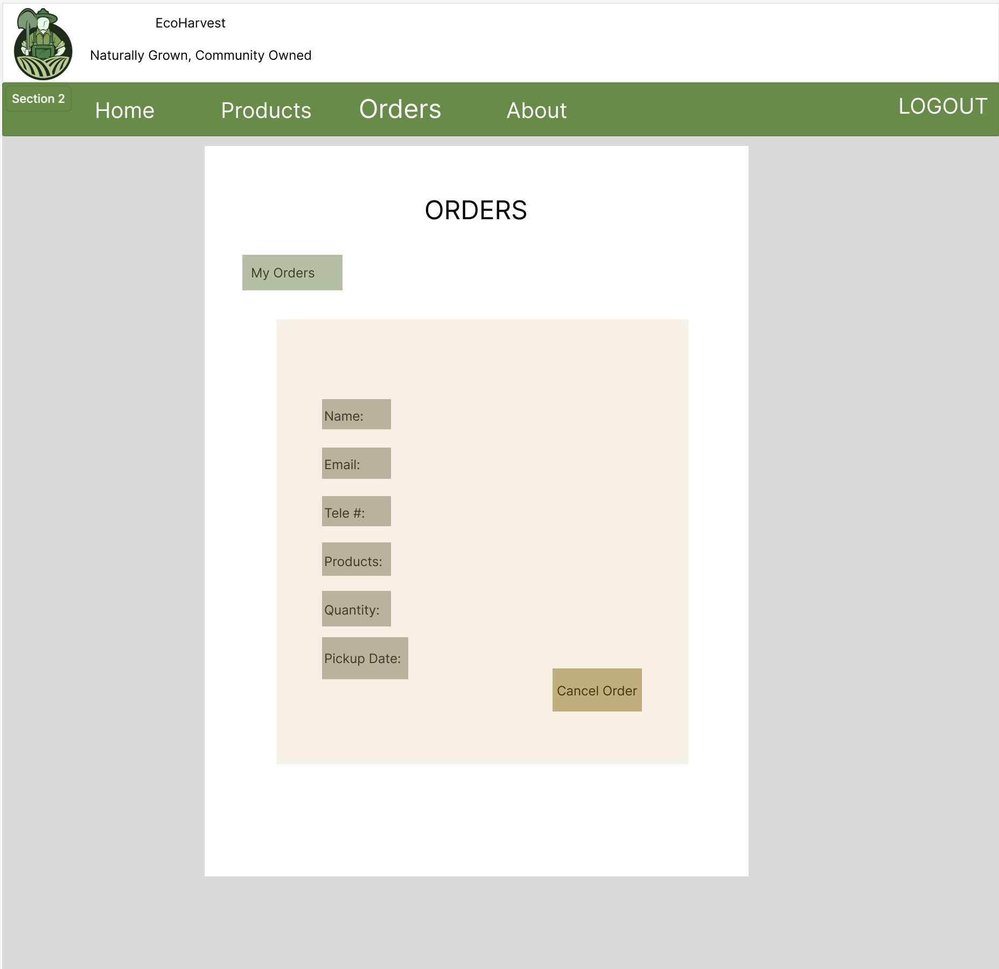
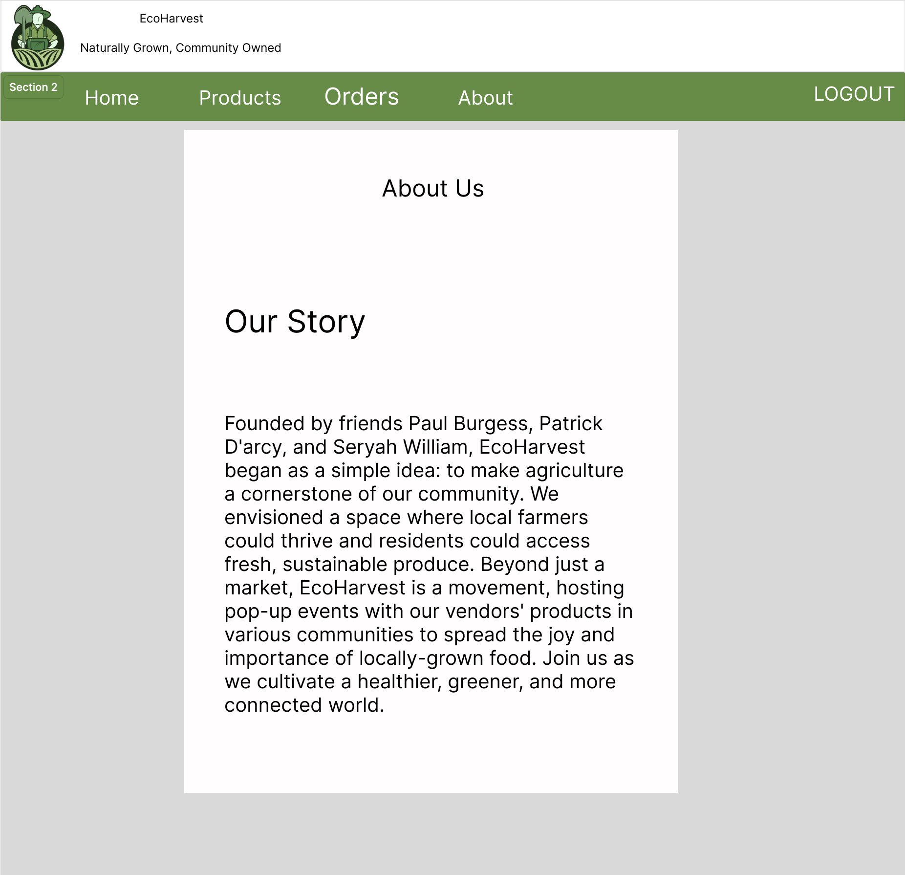
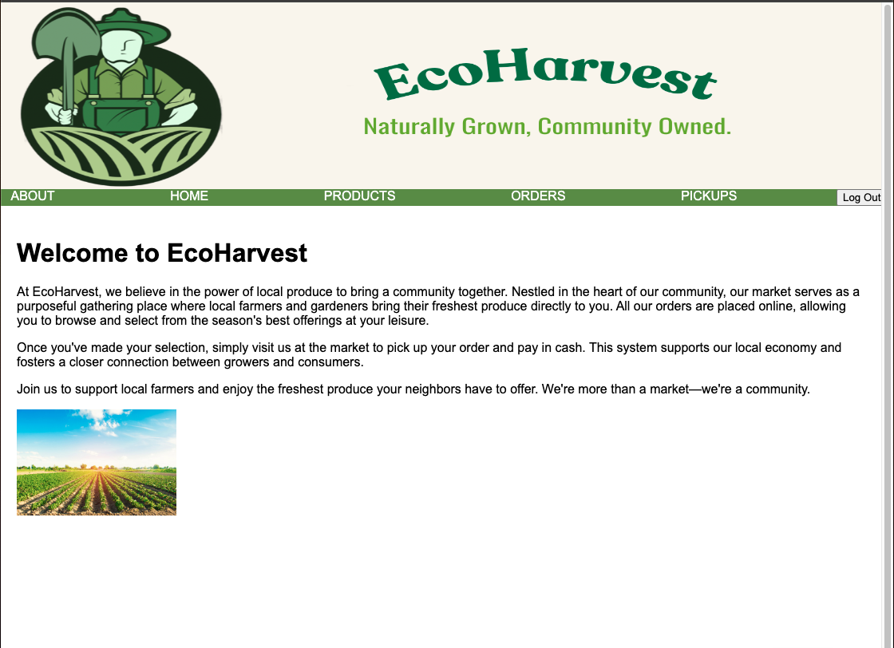
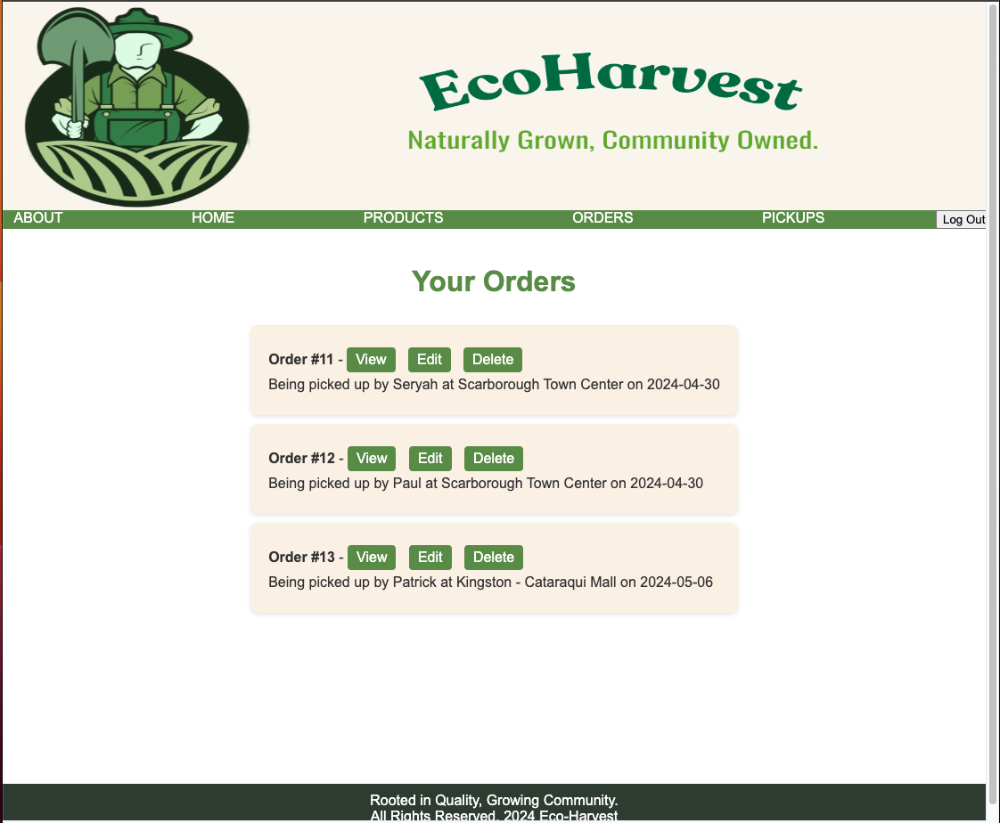
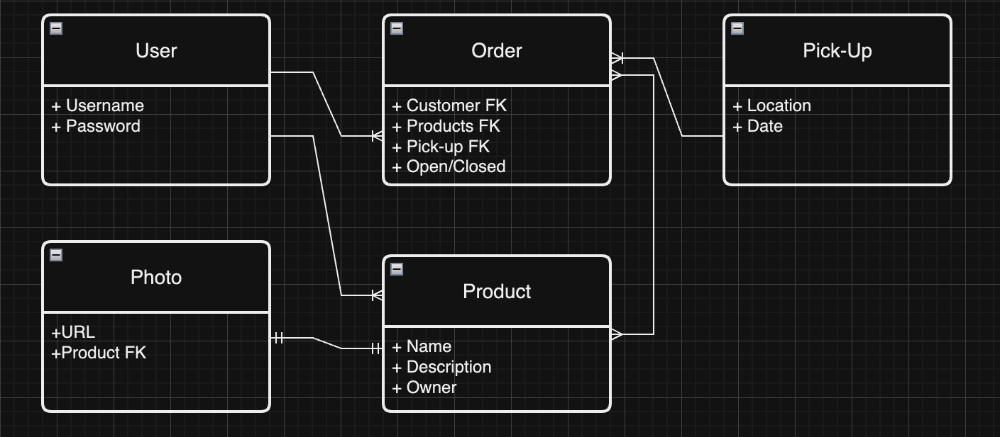

#  Eco-Harvest
A full-stack web application used for a Direct-to-Consumer produce production.
### Project Started: 2024/04/17
### By: Seryah Williams, Paul Burgess, & Patrick D'Arcy
#### [Seryah's GitHub](https://github.com/SeryahWilliam) 
#### [Paul's GitHub](https://github.com/pauljburgess) 
#### [Patrick's GitHub](https://github.com/rela7e) 

***

### **Description**
This app has a database of different produce from a local farmer. As a browser, people are able to see a list of produce and products available for sale, and details about each one.

If they choose to make an account and login, they will then gain the ability to place an order (consisting of the products they choose and a location/date they will pick out of available choices), view any of their previous orders, and update and delete any open orders.

---

### **Technologies Employed**

- HTML 
- CSS
- Python
- Postgresql
- Django
    - Class-Based Views
    - Authentication

---

### **Deployed App**

Getting started is easy! You can check out the app [here]() on Heroku. 

---

### **Wireframes**

##### Home Page

##### Products Page

##### Products Detail Page

##### Orders Page

##### Create an Order Page

##### My Orders Page

##### About Page

---
### Deployed App Screen Shots

##### Home Page

##### My Orders Page

---
### Backend ERD

---
### Pitch Deck and Trello Board

[This](https://docs.google.com/presentation/d/1USgFQzdIMH2-mT0xAZy4SzwDUwPvVgptEIK0HRhRevg/edit?usp=sharing) was the slideshow used to pitch the project.

This project also used a [Trello](https://trello.com/b/fHnGf0q1/project-3) board during development.

---
### **Future Updates**

- [ ] Add the ability to have multiple venders use the website.
- [X] Deploy the app

---
### **References**

The [Cat Collector](https://generalassembly.instructure.com/courses/196/pages/django-urls-views-and-templates?module_item_id=8094) lessons of General Assembly were used as a primary reference for this project.
